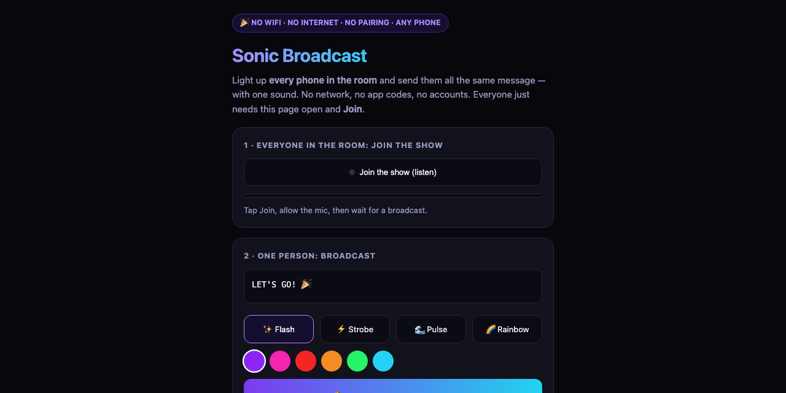

# Sonic Broadcast

One sound makes every phone in the room flash in sync and show the same message. No WiFi, no internet, no app, no pairing. Point a speaker at the crowd.

  

**Try it: https://suncal.github.io/sonicbroadcast/**

## What it does

- One-to-many over audible sound, built on the SoundLink acoustic modem
- Every phone that has the page open receives the same message at the same moment and lights up its screen
- Made for concerts, classrooms, weddings and any room where you cannot get 500 people onto one WiFi
- Nothing mainstream does room-scale sound broadcast across iPhone and Android

## Run it

Open the live link on everyone's phone, then broadcast from one device through a speaker.

---

**If this is useful to you, a ⭐ on the repo helps other people find it.** Issues and pull requests are welcome.

Built by [Priyankar "Sunny" Chakraborty](https://github.com/suncal) · [everbuiltstudio.com](https://everbuiltstudio.com)
